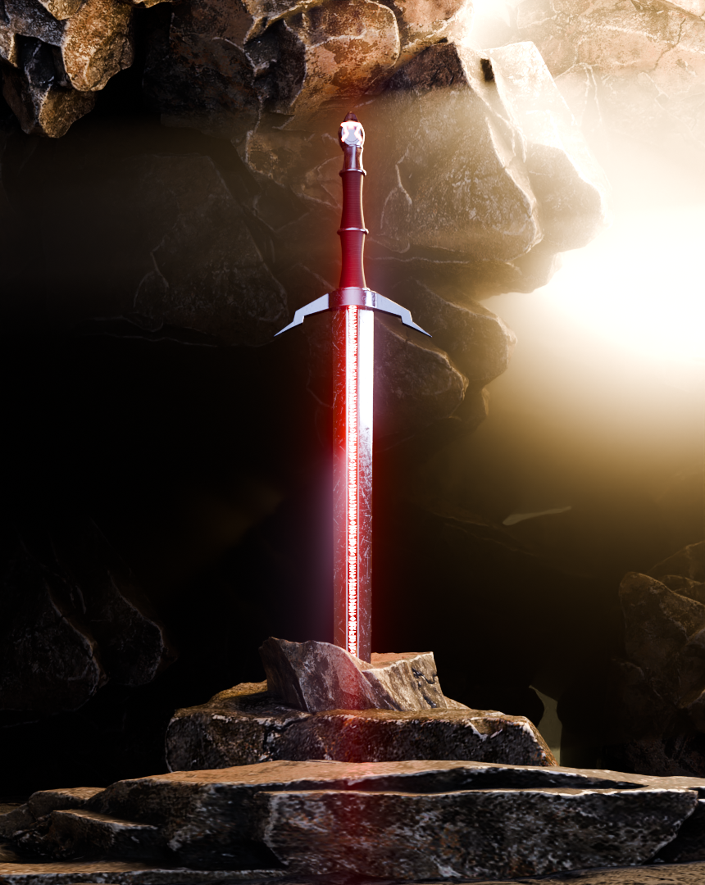
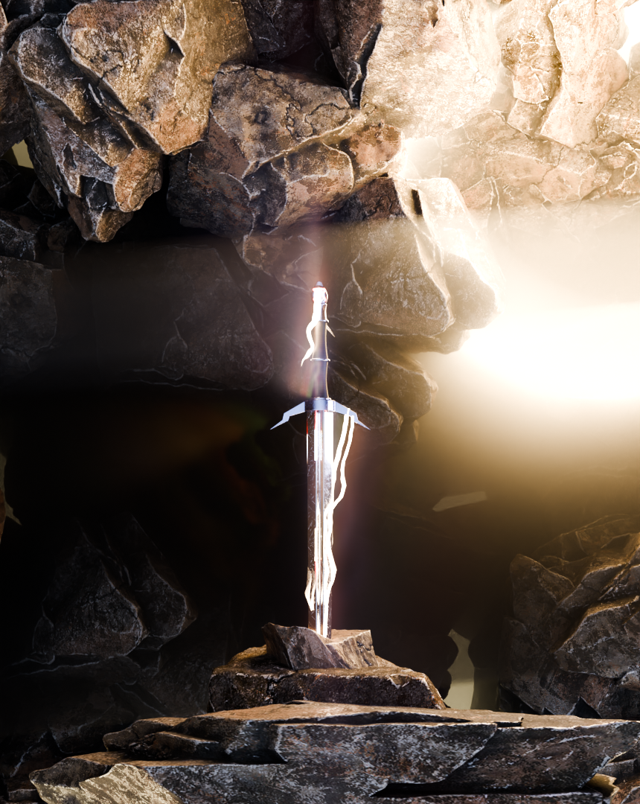

# 🗡️ 3D Sword in Stone - Blender Project  

## 📌 About the Project  
This is a **3D model of a sword embedded in a stone**, created using **Blender**. The project includes a textured model and an animation of the sword being pulled from the stone. Ideal for learning **Blender modeling, texturing, and basic animation**.  

---

## 🖼️ Preview  
  

  

---
## 🛠️ Setup & Usage  

### 🔹 Requirements  
- **Blender** (Download: [https://www.blender.org/download/](https://www.blender.org/download/))  
- A computer with a **decent GPU** for rendering  

### 🔹 How to Open the Project  
1. Download and install **Blender**.  
2. Clone the repository or **Download as ZIP**.  
   ```sh
   git clone https://github.com/milindgajbhiye/3D-Sword-Project.git

## 🎓 Tutorials Used
### Here are some tutorials that helped in making this project:

- Blender Basics for Beginners
- Modeling a Sword in Blender
- Animating in Blender

## 📧 Contact
 ### For any questions or suggestions, feel free to reach out:
 - 📩 Email: gajbhiyemilind11@gmail.com
-  🌐 GitHub: @milindgajbhiye
